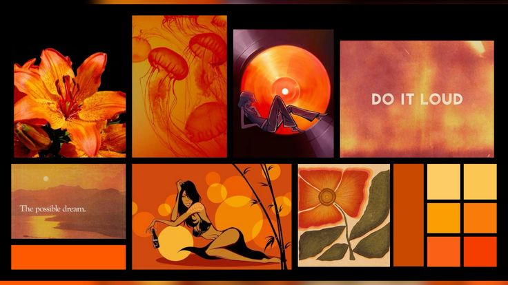

<!-- BANNER PNG/JPG:
     Coloque sua imagem em assets/banner.png e remova os comentários das linhas abaixo.
-->

  

<h1 align="center">Olá, eu sou a Giovanna Ribeiro 👋</h1>

  Estudante de Ciência da Computação • Desenvolvimento web • Acessibilidade digital

  
  

---

## Sobre mim

Sou estudante de Ciência da Computação e tenho interesse em desenvolvimento web e acessibilidade digital. Neste perfil, compartilho projetos acadêmicos e experiências com diferentes tecnologias — de aplicações web a programas em Python.

## Tecnologias

  
  
  
  
  
  

## Projetos em destaque

### [Engaja](https://github.com/gioribeirro11/Engaja)
Aplicação para gestão de eventos educacionais, inscrições, presenças e relatórios de engajamento. Desenvolvida com Laravel e Bootstrap.

<!-- CAPTURA PNG/JPG:
     Coloque uma imagem em assets/engaja.png e remova os comentários das linhas abaixo.
-->
<!--

  

-->

### [Sistema de Agendamento de Consultas](https://github.com/gioribeirro11/Sistema-de-Agendamento-de-Clinica-Geral)
Aplicação desktop em Python com Tkinter para agendar, consultar e cancelar consultas. Os dados são armazenados em um arquivo JSON.

<!-- CAPTURA PNG/JPG:
     Coloque uma imagem em assets/agendamento.png e remova os comentários das linhas abaixo.
-->
<!--

  

-->

### [Street Feet](https://github.com/gioribeirro11/Street-Feet)
Protótipo acadêmico de loja virtual de tênis, com páginas em HTML e CSS e uma implementação inicial de cadastro e autenticação com PHP e MySQL.

<!-- CAPTURA PNG/JPG:
     Coloque uma imagem em assets/street-feet.png e remova os comentários das linhas abaixo.
-->
<!--

  

-->

## Demonstração em GIF

<!-- GIF:
     Coloque sua demonstração animada em assets/demo.gif e remova os comentários das linhas abaixo.
-->
<!--

  

-->

## Estatísticas do GitHub

  
  

## Contato

- GitHub: [@gioribeirro11](https://github.com/gioribeirro11)

<!-- Opcional: adicione seu LinkedIn ou e-mail abaixo.
- LinkedIn: [seu perfil](https://www.linkedin.com/in/seu-usuario/)
- E-mail: [seu-email](mailto:seu-email)
-->
